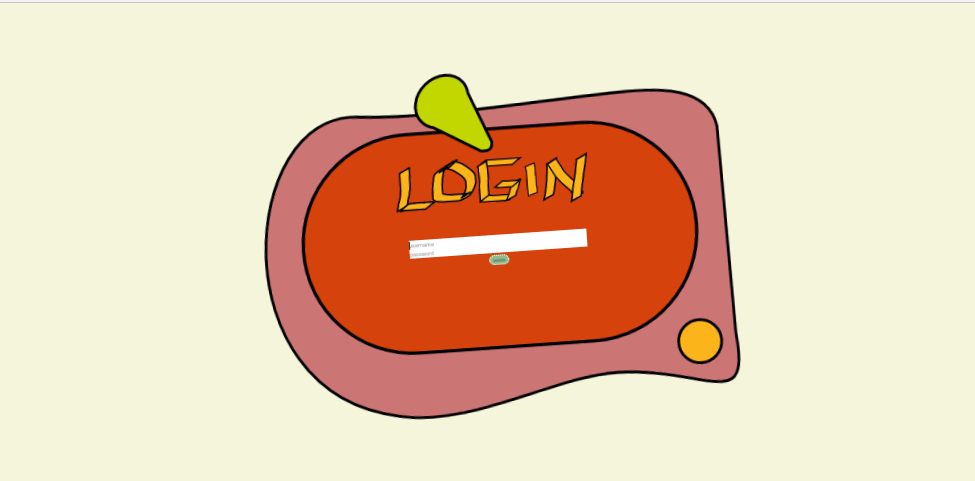
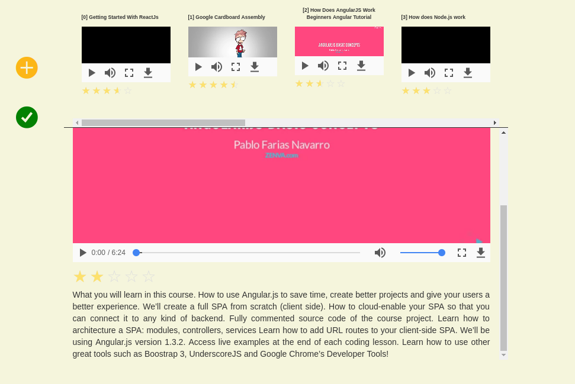

# CrossPlay 

A simple three pages application that lists preferred videos of users. Videos are fetched by a local server (for which I do not own property). The client has been written in 24 hours.

  

## Index
1. Introduction
2. Installation
3. Run
4. How to Demo
5. Test
6. Documentation

### Introduction

CrossPlay is a Angular2 app, that relies on the following (main) dependencies:

- bootstrap 3.3.7 (for responsiveness)
- ReactJS 5.1.0 (for events handling)
- ngx-rating 0.0.9 (for the rating funcionality)
- karma 1.4.1 (for Unit Tests)

### Installation

The installation require npm packet manager.
Follow these steps to install the app:

cd assignment
npm uninstall -g @angular/cli angular-cli
npm cache clean
npm install -g @angular/cli@latest
npm install
ng build
cp -R ./dist/* /path/to/node/backend/client

### Run

Follow these steps to run the app:

cd /path/to/node/backend
npm start

open a browser and navigate to localhost:3000 (login:ali, password: password)

  

### HOW to DEMO

The following is the default flow that a user can follow to experience the app funcionalities.

- users navigate to localhost:3000

- users login (-> access the videos list page)

- in the list page, users can
	a) scroll videos
	b) play some video
	c) open the detail of a video (by clicking on its title)
	d) exit the app (by on the yellow X on the left)
	
- in the detail page users can
	a) scroll video in the sidebar
	b) play video
	c) rate a video
	d) open the detail of a video (by clicking on its title)
	e) go back to the list page
	f) exit the app (by on the yellow X on the left)
	
- users cannot navigate to localhost:3000/#/list if they are not logged
- users cannot navigate to localhost:3000/#/detail if they are not logged

### Test

The application has been corredated by a stack of 13 Unit Tests, one for each component/service of the app.
Follow these steps to test the app

cd assignment
ng test

### DOCUMENTATION

CrossPlay has one single Module: the AppModule. This module contains
- 4 Services (Base,User,Video and Events -service)
- 7 Components (App, Login, VideoList, Video, Detail, Navigator and Notification -component)
- 1 Directive (ScrollTrackerDirective)
- 1 Guard (LoginGuard)
- 1 model (Video)

The source folder is thus organized in the following tree:
- src
	- core (contains services[4], directives[1], models[1] and guards[1])
	- detail
	- login
	- navigator
	- notification
	- video
	- video-list

#### Services
Base, User and Video services are REST services; EventsService is an event manager that uses ReactiveJS.

The UserService manages the user authentication, the VideoService manages the video fetching and rating.
UserService and VideoService extends from BaseService, which defines two important common service property:

- the server url
- the exception management strategy

These properties can be easily maintained due to modularization.

EventsService manages the interaction between components, signaling the following events

- isLogged (used by LoginComponent [to signal that the user has logged] and by LogindGuard [to permit masked routes to be accessed only by logged users])
- scrolledToBottom (used by the ScrollTrackerDirective to signal the VideoListComponent that the user has scrolled)
- notifySuccess (to signal the NotificationComponent that the user must be notified of a successfull operation)

#### Components

The AppComponent is the app root. It holds 
- the Navigator and Notification -components
- the other components used by the app Router

The main components are VideoListComponent and DetailComponent, they realize the content of the video list page and the detail page.

Components use and reuse themselves, in these hierarchies:

- VideoListComponent uses VideoComponent
- DetailComponent uses VideoListComponent and VideoComponent

Parents and children components communicate via EventEmitters (like the playClicked EventEmitter); non-relative components communicate via EventsService.

